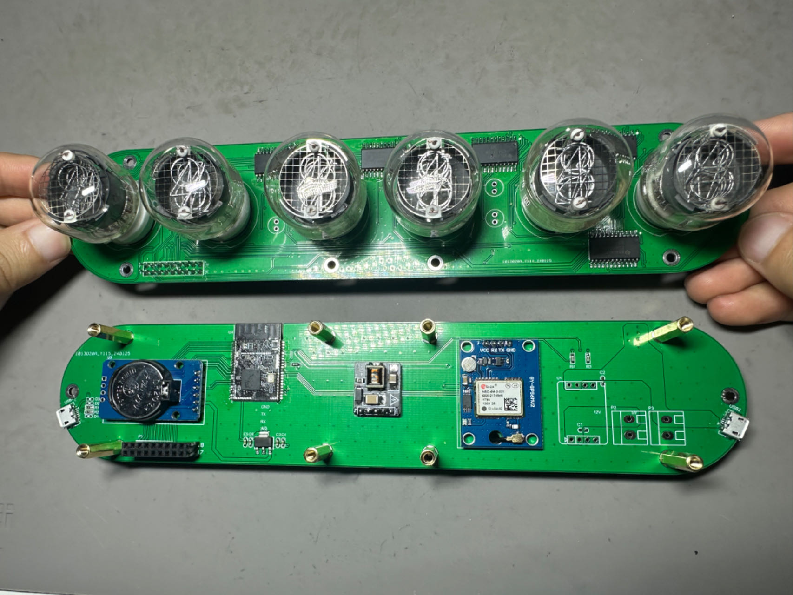
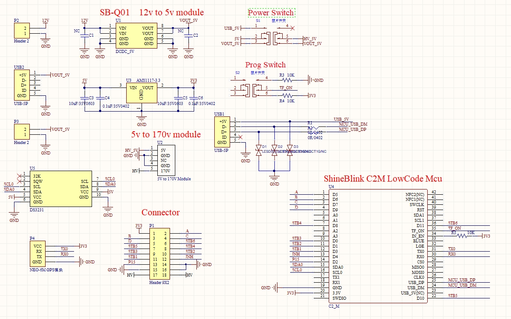

# GPS辉光管时钟

<!-- LANG:ZH -->

## 前言

本文开源 FlexLua 低代码单片机技术，无需复杂单片机C语言开发。即使新手也可很容易用FlexLua零门槛开发各种功能丰富稳定可靠的 IoT 硬件，更多学习教程可参考 FlexLua 官网（flexlua.com）。

## 1. 功能介绍

6 个辉光管分别显示时,分,秒，两个氖气灯作为时间分隔小点。每次电路板上电后尝试通过 NEO-6M GPS 模块同步一次 UTC 时间并存储到 DS3231 RTC 时钟模块中。之后即可长期通过 RTC 时钟模块获取并显示时间，即使 GPS 不再使用。

<!-- LANG:EN -->

## Preface

This article open sources the FlexLua low-code microcontroller technology, eliminating the need for complex microcontroller C language development. Even beginners can easily develop various feature-rich, stable, and reliable IoT hardware with zero threshold using FlexLua. For more learning tutorials, please refer to the FlexLua official website (flexlua.com).

## 1. Function Introduction

6 neon tubes respectively display hours, minutes, and seconds, with two neon lights serving as time separators. After each power-up of the circuit board, attempt to synchronize UTC time once through the NEO-6M GPS module and store it in the DS3231 RTC clock module. Afterwards, time can be obtained and displayed through the RTC clock module for a long time, even if GPS is no longer used.

<!-- LANG:ZH -->

## 2. 硬件方案介绍

- ShineBlink C2M 低代码单片机：用来运行整个系统的 Lua 代码
- DS3231 RTC 时钟模块：带 CR2302 电池，可长期存储并维持实时 UTC 时间
- NEO-6M GPS 模块：用于通过 GPS 卫星获取真实的 UTC 时间
- CD4514BM：4-16译码器芯片
- 5v-170v 辉光管升压模块：用于驱动辉光管时钟，采用日本 TTRN-060S 变压器，某宝搜索有卖

<!-- LANG:EN -->

## 2. Hardware Solution Introduction

- ShineBlink C2M low-code microcontroller: Used to run the entire system's Lua code
- DS3231 RTC clock module: Equipped with CR2302 battery, can store and maintain real-time UTC time for a long time
- NEO-6M GPS module: Used to obtain real UTC time via GPS satellites
- CD4514BM: 4-to-16 decoder chip
- 5V-170V neon tube boosting module: Used to drive neon tube clocks, using the Japanese TTRN-060S transformer, available for purchase on Taobao

## 3. 硬件原理图（Hardware Schematic）

### 顶板（Top Board）

### 底板（Bottom Board）

<!-- LANG:ZH -->

> 注意：如果用 USB 5v 供电，SB-Q01 12v 转 5v 模块不需要焊接。

## 4. 代码下载和上电运行

### 代码下载：

Step1：将 S1（Power Switch） 开关拨至 USB_5V（让 HV_5V 供电无法升压到 160V 以免影响下载程序）

Step2：用 Micro USB 数据线连接 USB1 口和电脑

Step3：将 S2 （Prog Switch）开关拨至 3V3，当 TF_ON 引脚为高电平时 ShineBlink C2M 进入下载模式，这时电脑上会出现一个 1.6M 大小的虚拟 U 盘

Step4：将 main.lua 源代码直接拖入 U 盘，然后再将 S2 开关拨至 GND

### 上电运行：

Step1：S1 （Power Switch）开关保持在 VOUT_5V（让 HV_5V 升压到 160V 驱动辉光管）

Step2：S2 （Prog Switch）开关保持在 GND

Step3：通过 Micro USB 线给 USB2 口提供 5v 工作电源

<!-- LANG:EN -->

> Note: If powered by USB 5V, the SB-Q01 12V to 5V module does not need to be soldered.

## 4. Code Download and Power-Up Operation

### Code Download:

Step1: Set the S1 (Power Switch) to USB_5V (to prevent HV_5V from boosting to 160V and affecting program download)

Step2: Connect USB1 port to the computer using a Micro USB data cable

Step3: Set the S2 (Prog Switch) to 3V3, when the TF_ON pin is high, the ShineBlink C2M enters download mode, and a virtual U disk of about 1.6M will appear on the computer

Step4: Drag the main.lua source code directly into the U disk, then set the S2 switch to GND

### Power-Up Operation:

Step1: Keep the S1 (Power Switch) at VOUT_5V (to boost HV_5V to 160V to drive the neon tube)

Step2: Keep the S2 (Prog Switch) at GND

Step3: Provide 5V working power to USB2 port via Micro USB cable