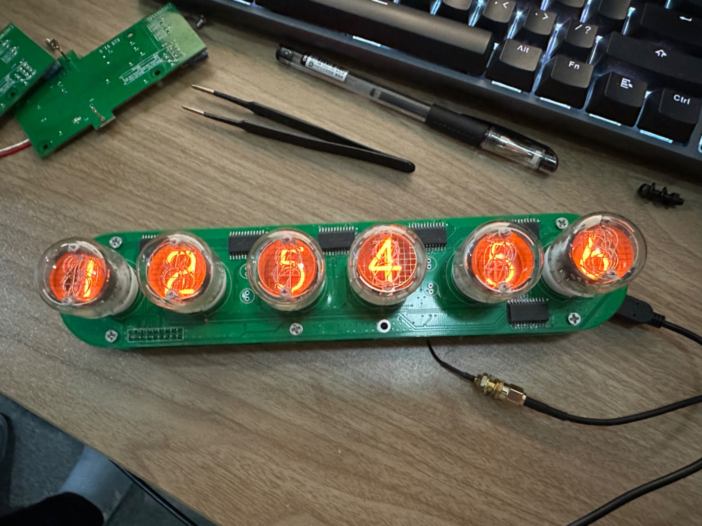
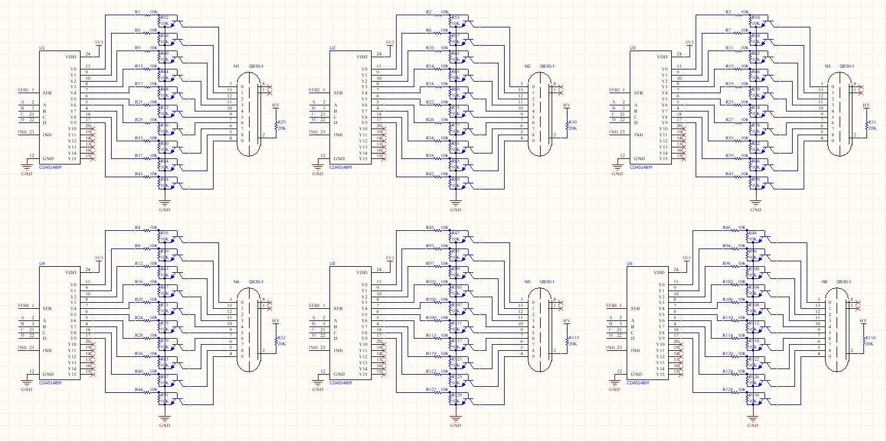

# GPS辉光管时钟

## 1. 功能介绍

6 个辉光管分别显示时,分,秒，两个氖气灯作为时间分隔小点。每次电路板上电后尝试通过 NEO-6M GPS 模块同步一次 UTC 时间并存储到 DS3231 RTC 时钟模块中。之后即可长期通过 RTC 时钟模块获取并显示时间，即使 GPS 不再使用。

## 2. 硬件方案介绍

- ShineBlink C2M 低代码单片机：用来运行整个系统的 Lua 代码
- DS3231 RTC 时钟模块：带 CR2302 电池，可长期存储并维持实时 UTC 时间
- NEO-6M GPS 模块：用于通过 GPS 卫星获取真实的 UTC 时间
- CD4514BM：4-16译码器芯片
- 5v-170v 辉光管升压模块：用于驱动辉光管时钟，采用日本 TTRN-060S 变压器，某宝搜索有卖

## 3. 硬件原理图

### 顶板

### 底板

> 注意：如果用 USB 5v 供电，SB-Q01 12v 转 5v 模块不需要焊接。

## 4. 代码下载和上电运行

### 代码下载：

Step1：将 S1（Power Switch） 开关拨至 USB_5V（让 HV_5V 供电无法升压到 160V 以免影响下载程序）

Step2：用 Micro USB 数据线连接 USB1 口和电脑

Step3：将 S2 （Prog Switch）开关拨至 3V3，当 TF_ON 引脚为高电平时 ShineBlink C2M 进入下载模式，这时电脑上会出现一个 1.6M 大小的虚拟 U 盘

Step4：将 main.lua 源代码直接拖入 U 盘，然后再将 S2 开关拨至 GND

### 上电运行：

Step1：S1 （Power Switch）开关保持在 VOUT_5V（让 HV_5V 升压到 160V 驱动辉光管）

Step2：S2 （Prog Switch）开关保持在 GND

Step3：通过 Micro USB 线给 USB2 口提供 5v 工作电源

