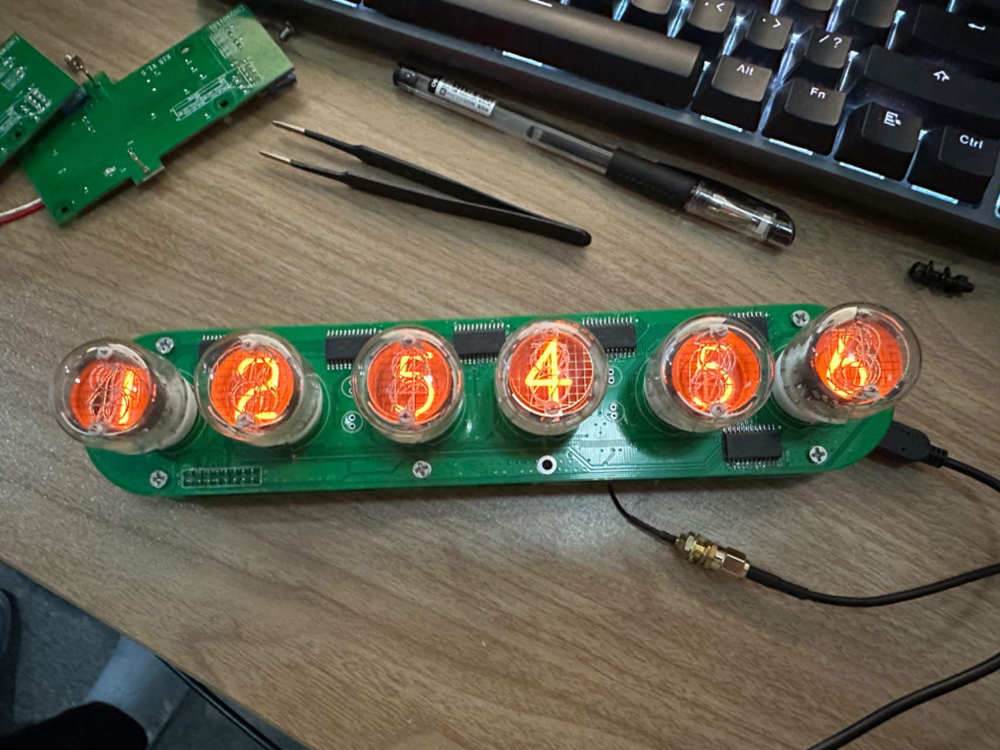
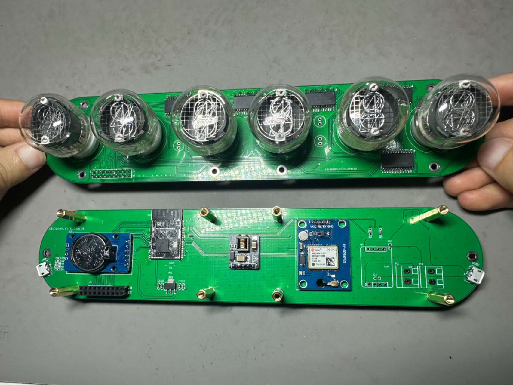
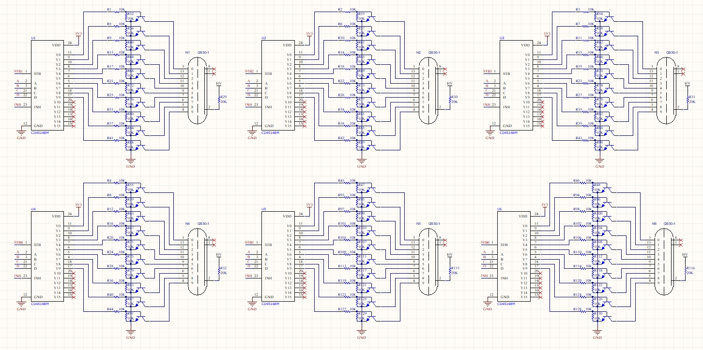

# GPS Nixie Tube Clock

# README.md

- zh_CN [简体中文](README.md)

## Preface

This article open sources the FlexLua low-code microcontroller technology, eliminating the need for complex microcontroller C language development. Even beginners can easily develop various feature-rich, stable, and reliable IoT hardware with zero threshold using FlexLua. For more learning tutorials, please refer to the FlexLua official website (flexlua.com).

## 1. Function Introduction

6 neon tubes respectively display hours, minutes, and seconds, with two neon lights serving as time separators. After each power-up of the circuit board, attempt to synchronize UTC time once through the NEO-6M GPS module and store it in the DS3231 RTC clock module. Afterwards, time can be obtained and displayed through the RTC clock module for a long time, even if GPS is no longer used.

## 2. Hardware Solution Introduction

- ShineBlink C2M low-code microcontroller: Used to run the entire system's Lua code
- DS3231 RTC clock module: Equipped with CR2302 battery, can store and maintain real-time UTC time for a long time
- NEO-6M GPS module: Used to obtain real UTC time via GPS satellites
- CD4514BM: 4-to-16 decoder chip
- 5V-170V neon tube boosting module: Used to drive neon tube clocks, using the Japanese TTRN-060S transformer, available for purchase on Taobao

## 3. Hardware Schematic

### Top Board

### Bottom Board

> Note: If powered by USB 5V, the SB-Q01 12V to 5V module does not need to be soldered.

## 4. Code Download and Power-Up Operation

### Code Download:

Step1: Set the S1 (Power Switch) to USB_5V (to prevent HV_5V from boosting to 160V and affecting program download)

Step2: Connect USB1 port to the computer using a Micro USB data cable

Step3: Set the S2 (Prog Switch) to 3V3, when the TF_ON pin is high, the ShineBlink C2M enters download mode, and a virtual U disk of about 1.6M will appear on the computer

Step4: Drag the main.lua source code directly into the U disk, then set the S2 switch to GND

### Power-Up Operation:

Step1: Keep the S1 (Power Switch) at VOUT_5V (to boost HV_5V to 160V to drive the neon tube)

Step2: Keep the S2 (Prog Switch) at GND

Step3: Provide 5V working power to USB2 port via Micro USB cable